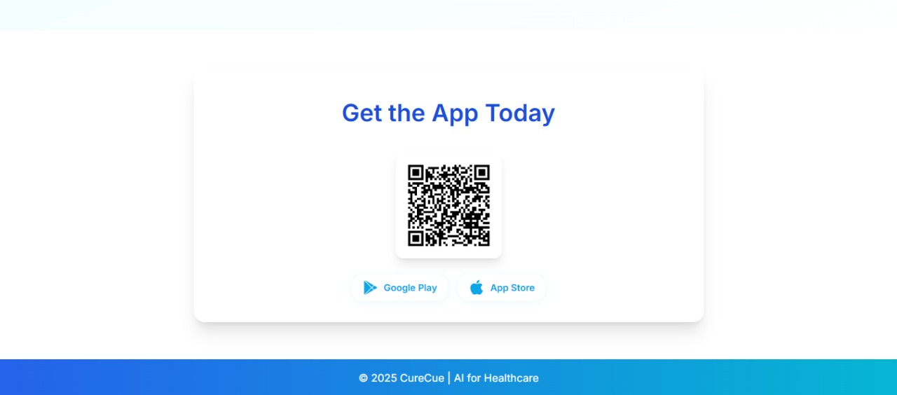

# CureCue – AI Healthcare Suite

**CureCue** is an AI-powered healthcare suite designed to empower patients and healthcare professionals with intelligent, mobile-first tools for safer, smarter, and more accessible healthcare experiences.

---

## Key Features

- **Expiry Date Checker**  
  Instantly detect expiry dates on medicines using your phone camera and Vision AI.

- **Adherence Assistant**  
  Smart reminders and scheduling to help patients never miss a dose, with multilingual support.

- **Prescription Reader**  
  Extract and interpret complex handwritten prescriptions using advanced OCR.

- **Gemini-Powered Knowledge Base**  
  Get instant, reliable answers about medicines from our Gemini AI-powered database.

- **Multilingual Support**  
  Access all tools in your preferred language for better understanding and comfort.

---

## Made for Mobile

CureCue is designed for your phone. Scan, track, and manage your health on the go with our intuitive mobile app.

---

## Application Snapshots

<p align="center">
  
  
  
  
  
  
  
</p>

---

## Our Team

- **Puneet** – Team Lead & Web App Architect  
  BS & Research Scholar @ IITM

- **Pranshu Jaiswal** – Expiry Date Reader & OCR Workflows  
  Final Year Undergrad, IITM

- **Saransh Saini** – Adherence Assistant & Mobile App  
  Pre-final Year Undergrad, IITM

---

## Technical Report

A detailed technical report is available in the app (see "How It Works?").

---

## Getting Started

1. **Clone the repository:**
   ```bash
   git clone <repository-url>
   cd cure-cue
   ```

2. **Install dependencies:**
   ```bash
   pip install -r requirements.txt
   ```

3. **Run the application:**
   ```bash
   python app.py
   ```

4. **Open your browser and visit:**  
   [http://localhost:5000](http://localhost:5000)

---

## Folder Structure

```
cure-cue/
│
├── app.py
├── requirements.txt
├── static/
│   ├── images/
│   ├── uploads/
│   └── ...
├── templates/
│   └── landing_page.html
└── ...
```

---

## Get the App

Scan the QR code in the application to download CureCue on your device:

---

&copy; 2025 CureCue | AI for Healthcare